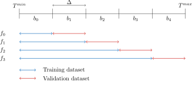
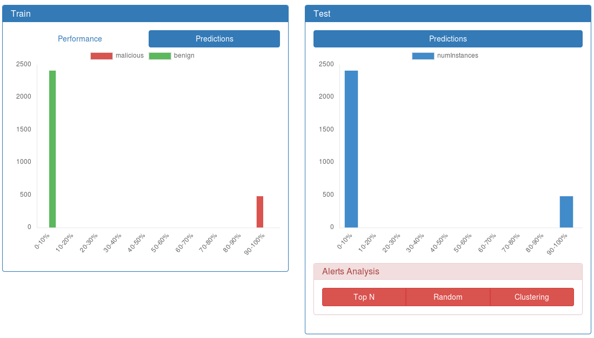
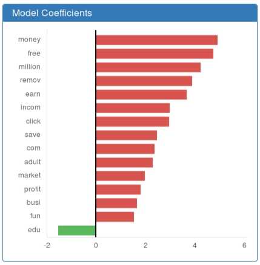

.. _DIADEM:

DIADEM: DIAgnosis of DEtection Models
=====================================

**Training and Analysing a Detection Model before Deployment.**

| *Usage:* ``SecuML_DIADEM <project> <dataset> <model_class>``.
| For more information about the available options for a given model class:
| ``SecuML_DIADEM <project> <dataset> <model_class> -h``.

DIADEM trains and evaluates supervised detection models.
It hides some of the machine learning machinery (feature standardization, setting of the hyperparameters)
to let security experts focus mainly on detection.
Besides, it comes with a :ref:`graphical user interface <diadem-gui>` to evaluate and diagnose detection models.

.. rubric:: References

* Beaugnon, Anaël. `"Expert-in-the-Loop Supervised Learning for Computer Security Detection Systems."] <https://www.ssi.gouv.fr/uploads/2018/06/beaugnon-a_these_manuscrit.pdf>`_, Ph.D. thesis, École Normale Superieure (2018).
* [FRENCH] Bonneton, Anaël, and Antoine Husson, `"Le Machine Learning confronté aux contraintes opérationnelles des systèmes de détection" <https://www.sstic.org/media/SSTIC2017/SSTIC-actes/le_machine_learning_confront_aux_contraintes_oprat/SSTIC2017-Article-le_machine_learning_confront_aux_contraintes_oprationnelles_des_systmes_de_dtection-bonneton_husson.pdf>`_, SSTIC 2017.

Model Classes Available
-----------------------

* LogisticRegression
* Svc
* GaussianNaiveBayes
* DecisionTree
* RandomForest
* GradientBoosting

.. note::

    For now, DIADEM supports only supervised detection models.
    It does not support unsupervised and semi-supervised detection models yet.

| DIADEM can train a new supervised detection model,
| ``SecuML_DIADEM <project> <dataset> <model_class>``,
| or apply a previously trained detection model,
| ``SecuML_DIADEM <project> <dataset> AlreadyTrained --model-exp-id <exp_id>``.

.. note::

  In the latter case, ``--model-exp-id`` must correspond to a :ref:`DIADEM <DIADEM>` or an :ref:`ILAB <ILAB>` experiment.

.. _diadem-validation-modes:

Validation Modes Available
--------------------------
DIADEM offers several validation modes, i.e. ways to build the training and the validation datasets.
Temporal validation modes (:ref:`temporal-split`, :ref:`cutoff-time`, :ref:`temporal-cv`, and :ref:`sliding-window`)
should be preferred when
the instances are timestamped since they better reflect real-world conditions.
These validation modes ensure that no instance from the future is used when the detection model is trained:
the training instances predate the validation instances.

.. _random-split:

Random Split
^^^^^^^^^^^^
``--test-mode RandomSplit --test-size <prop>``

``<prop>`` instances of ``<dataset>`` are selected uniformly for the validation dataset.
The remaining instances constitute the training dataset.

.. _temporal-split:

Temporal Split
^^^^^^^^^^^^^^
``--test-mode TemporalSplit --test-size <prop>``

The ``<prop>`` most recent instances of ``<dataset>`` are selected for the validation dataset.
The remaining instances constitute the training dataset.

.. _cutoff-time:

Cutoff Time
^^^^^^^^^^^
``--test-mode CutoffTime --cutoff-time <cutoff_time>``

The instances of ``<dataset>`` with a timestamp before ``<cutoff_time>`` constitutes
the training dataset, and the instances after constitute the validation dataset.
``<cutoff_time>`` must be formatted as follows:
``YYYY-MM-DD HH:MM:SS``.

.. _cv:

Cross Validation
^^^^^^^^^^^^^^^^

``--test-mode Cv --validation-folds <num_folds>``

The dataset ``<dataset>`` is divided uniformly into ``<num_folds>`` buckets.
Each bucket has approximately the same number
of instances and the same proportion of benign/malicious instances as the whole dataset.
The detection model is trained ``<num_folds>`` times: each time, one bucket is the validation dataset and the other buckets
form the training dataset.

*Example with* :math:`\text{num_folds} = 4`:

.. image::  figs/validation_diagrams/cv.svg
   :width: 90%
   :align: center

.. _temporal-cv:

Temporal Cross Validation
^^^^^^^^^^^^^^^^^^^^^^^^^
``--test-mode TemporalCv --validation-folds <num_folds>``

The dataset ``<dataset>`` is divided into ``<num_folds> + 1`` buckets.
Each bucket :math:`b_{i \in [0,~\text{num_folds}]}` contains instances
occurring between :math:`t_i^{max} = T^{min} + i \cdot \Delta`
and :math:`t_i^{max} = T^{min} + (i+1) \cdot \Delta`
where

* :math:`T^{min}` and :math:`T^{max}` correspond to the timestamps of the oldest and latest instances ;

* :math:`\Delta = \frac{T^{max} - T^{min}}{\text{num_folds} + 1}`.

For each fold :math:`f\in[0,\text{num_folds}-1]`, the buckets from :math:`b_0` to :math:`b_f` constitute
the training dataset, and the remaining buckets form the validation dataset.

*Example with* :math:`\text{num_folds} = 4`:

.. _sliding-window:

Sliding Window
^^^^^^^^^^^^^^

``--test-mode SlidingWindow --buckets <n> --train-buckets <n_train> --test-buckets <n_test>``

The dataset ``<dataset>`` is divided into ``<n>`` buckets
just as in the case of :ref:`temporal-cv`.
Each bucket :math:`b_{i \in [0,~n-1]}` contains instances
occurring between :math:`t_i^{max} = T^{min} + i \cdot \Delta`
and :math:`t_i^{max} = T^{min} + (i+1) \cdot \Delta`
where

* :math:`T^{min}` and :math:`T^{max}` correspond to the timestamps of the oldest and latest instances ;

* :math:`\Delta = \frac{T^{max} - T^{min}}{n}`.

For each fold :math:`f\in[0,n-(n_{train}+n_{test})+1]`,
the buckets from :math:`b_{f}`
to :math:`b_{f+n_{train}}` constitute
the training dataset, and the buckets from :math:`b_{f+n_{train}}`
to :math:`b_{f+n_{train}+n_{test}}`
form the validation dataset.

*Example with* :math:`n = 5`, :math:`n_{train} = 2` and :math:`n_{test} = 1`.

.. image::  figs/validation_diagrams/sliding_window.svg
   :width: 90%
   :align: center

.. _validation-dataset:

Validation Dataset
^^^^^^^^^^^^^^^^^^

``--test-mode ValidationDataset --validation-dataset <validation_dataset>``

The whole dataset ``<dataset>`` constitutes the training data, and ``<validation_dataset>`` constitutes
the validation data.

.. _diadem-gui:

Graphical User Interface
------------------------

Model Performance and Predictions
^^^^^^^^^^^^^^^^^^^^^^^^^^^^^^^^^
DIADEM displays the performance evaluation and the predictions of the detection model
both on the training and validation datasets.
The predictions analysis is always available,
while the performance evaluation can be computed only when the data are annotated.

**Performance.**
The *Performance* tab displays the detection and the false alarm rates
for a given detection threshold.
The value of the detection threshold can be modified through a slider
to see the impact on the detection and false alarm rates.
The confusion matrix and the ROC curve are also displayed.

.. _performance-tab:

.. figure:: figs/screen_shots/DIADEM/performance.png
  :align: center

  Performance Tab

**Predictions.**
The *Predictions* tab displays the histograms of the predicted probabilities of maliciousness.
When annotations are available, the instances are grouped by label.

.. _predictions-tab:

  Predictions Tab

Model Behavior
^^^^^^^^^^^^^^
DIADEM displays information about the global behavior of detection models.
This visualization allows to grasp how detection models make decisions
and to diagnose potential training biases.

It is currently implemented for linear (see :ref:`linear-model-coeff`)
and tree-based (see :ref:`tree-model-importance`) models.
DIADEM does not yet support model-agnostic interpretation methods.

These graphic depictions allow a focus on the most influential features
of the detection model.
Clicking on a given feature gives access to its descriptive statistics on the training data
(see :ref:`Descriptive Statistics <stats>`).
These statistics allow to understand why a feature has a significant impact on decision-making,
and may point out biases in the training dataset.

.. _linear-model-coeff:

  Features Coefficients of a Linear Model

.. _tree-model-importance:

.. figure:: figs/screen_shots/DIADEM/random_forest_importance.png
  :width: 49%
  :align: center

  Features Importance of a Tree-based Model

Individual Predictions
^^^^^^^^^^^^^^^^^^^^^^
DIADEM diagnosis interface also allows to examine individual predictions.
For example, the false positives and negatives can be reviewed
by clicking on the confusion matrix displayed by the :ref:`performance-tab`.

Besides, the :ref:`predictions-tab` allows to analyze the instances
whose predicted probability is within a given range.
For instance, the instances close to the decision boundary
(probability of maliciousness close to 50%) can be reviewed
to understand why the detection model is undecided.
Moreover, the instances that have been misclassified with a high level of confidence can be inspected
to point out potential annotation errors, or help finding new discriminating features.

**Description Panel**

DIADEM displays each instance in a *Description* panel.
:ref:`all-features` and :ref:`important-features` depict the default views of
the *Description* panel (available for any data type).

.. _all-features:

.. figure:: figs/screen_shots/DIADEM/features_values.png
  :width: 80%
  :align: center

  All the Features

.. _important-features:

.. figure:: figs/screen_shots/DIADEM/feature_weights.png
  :width: 80%
  :align: center

  Most Important Features

By default, the *Description* panel displays the features of the instance (see :ref:`all-features` ).
This visualization may be hard to interpret especially when the feature space is in high dimension.
:ref:`all-features` displays the features extracted from an email:
the number of occurrences of each word in the vocabulary.
Since the vocabulary contains 1000 words, this visualization is hardly interpretable for humans.

If an interpretable model has been trained, DIADEM also displays
the features that have the most impact on the prediction (see :ref:`important-features` ).
This visualization is easier to interpret than the previous one
since the features are sorted according to their impact in the decision-making process.

Other visualizations specific to the detection problem may be more relevant to analyze individual predictions.
In order to address this need, DIADEM enables users to plug problem-specific visualizations.
:ref:`mail-specific-visu` depicts a problem-specific visualization
we have implemented for spam detection. It displays simply the raw content of the email.
We strongly encourage to implement convenient problem-specific visualizations (see :ref:`problem-specific-visu`),
since they can significantly ease the analysis of individual predictions.

.. _mail-specific-visu:

.. figure:: figs/screen_shots/DIADEM/mail.png
  :width: 80%
  :align: center

  Problem-specific Visualization for Spam Detection
