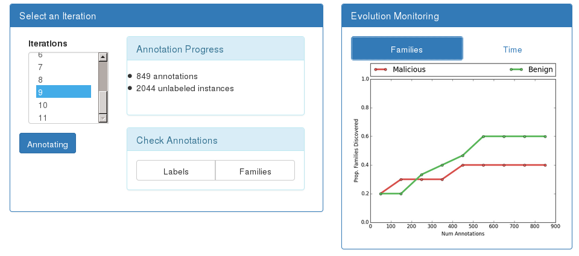

.. _RCD:

Rare Category Detection
========================

| *Usage:* ``SecuML_rare_category_detection <project> <dataset>``.
| For more information about the available options:
| ``SecuML_rare_category_detection <project> <dataset> -h``.

SecuML allows to explore a dataset interactively with rare category detection.
It is an iterative process, where the user is asked to annotate some instances at each iteration.

Graphical User Interface
------------------------

Monitoring Interface
^^^^^^^^^^^^^^^^^^^^^^^^^^^^^^^^^

Annotation Interface
^^^^^^^^^^^^^^^^^^^^^^^^^^^^^^^^^
.. image:: figs/screen_shots/RCD/annotations.png
