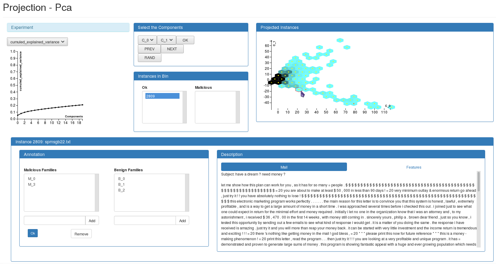

.. _projection:

#################################
Projection for Data Visualization
#################################

The data are projected into a lower-dimensional space for visualization.
They can be explored by displaying the instances projected in a plane
defined by two components.

*****
Usage
*****

| ``SecuML_projection <project> <dataset> <algo>``.
| For more information about the available options for a given projection algorithm:
| ``SecuML_projection <project> <dataset> <algo> -h``.

**Annotations.**
The annotations
(specified with ``-a GROUND_TRUTH`` or ``-a <partial_annotations>.csv``)
are displayed in the GUI to focus on areas with known malicious
instances. This way, the projections can allow to detect new malicious
instances close to the known ones.

Moreover, the annotations can be leveraged by
:ref:`semi-supervised algorithms <proj_semisupervised>`
through metric learning to bring malicious instances closer.
This way, it is even easier to detect unknown malicious instances
with the 2D visualizations.

Algorithms Available
====================

Unsupervised Algorithms
-----------------------
* Pca (`scikit-learn documentation <https://scikit-learn.org/stable/modules/generated/sklearn.decomposition.PCA.html>`__)

.. _proj_semisupervised:

Semi-supervised Algorithms
--------------------------
* Rca (`metric-learn documentation <https://metric-learn.github.io/metric-learn/metric_learn.rca.html>`__)
* Lda (`scikit-learn documentation <https://scikit-learn.org/stable/modules/generated/sklearn.discriminant_analysis.LinearDiscriminantAnalysis.html>`__)
* Lmnn (`metric-learn documentation <https://metric-learn.github.io/metric-learn/metric_learn.lmnn.html>`__)
* Nca (`metric-learn documentation <https://metric-learn.github.io/metric-learn/metric_learn.nca.html>`__)
* Itml (`metric-learn documentation <https://metric-learn.github.io/metric-learn/metric_learn.itml.html>`__)

************************
Graphical User Interface
************************

The instances are not displayed individually but with an hexagonal binning
for scalability.
The color of the bins, from blue to black, corresponds to the number of
instances in the bins.
The color of the dot in the middle of each bin (from yellow to red) corresponds
to the proportion of known malicious instances in the bin.
The orange and red dots allow to guide the exploration of the data
close to known malicious instances.

Clicking on an hexagon displays its instances in the
:ref:`Description panel<instance-visu>` at the bottom.
